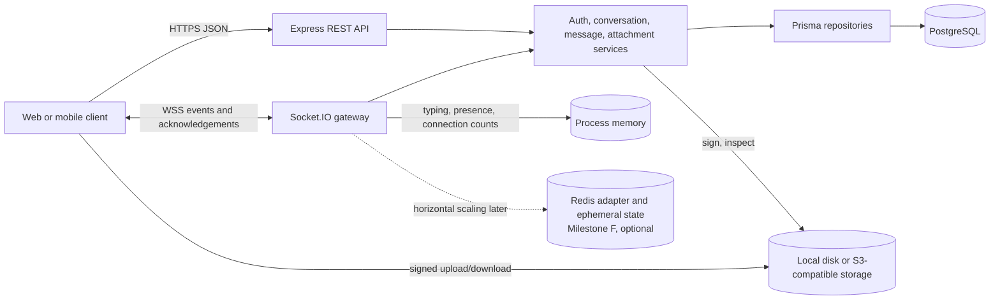

# Architecture

Convo is a modular monolith. Express and Socket.IO share one Node.js process and one HTTP server, while feature modules keep transport, business rules, persistence, and infrastructure concerns separate.

## Request and event flow

REST routes validate authentication, path/query/body data, and then call a transport-independent service. Socket handlers follow the same pattern and return a consistent acknowledgement envelope. Services own authorization and domain rules; repositories own Prisma queries and transaction boundaries.

PostgreSQL is the durable source of truth for users, refresh sessions, conversations, memberships, messages, delivery/read positions, and attachment metadata. Socket events are notifications rather than a replay log. A reconnect reloads room membership from PostgreSQL and tells the client to resynchronize durable state through REST.

Typing and presence are deliberately process-local and ephemeral in the single-instance implementation. They expire or are cleared on disconnect and are never persisted as chat history. Redis is not required for Milestone D; a Redis adapter and shared TTL-backed state belong to the optional multi-instance production milestone.

Attachment storage is selected with `ATTACHMENT_STORAGE_DRIVER`. With `s3`, bytes travel directly between the client and a private S3-compatible bucket. With `cloudinary`, the client uses a signed multipart upload and assets use authenticated delivery. With `local`, signed endpoints send bytes through the API to persistent disk. All drivers expose the same upload-contract, inspect, and download-contract interface; uploaded metadata is verified before message creation, while searchable attachment metadata remains provider-neutral in PostgreSQL.

## Module boundaries

- `src/modules/*`: validation, controllers, services, repositories, and domain access rules.
- `src/realtime/*`: socket authentication, room restoration, event handlers, presence, and typing state.
- `src/config/*`: validated environment, logging, Prisma, and object-storage clients.
- `src/middleware/*`: HTTP authentication, validation, request correlation/logging, and error mapping.
- `tests/unit`, `tests/integration`, `tests/realtime`, `tests/database`: progressively broader behavior boundaries.

The process shuts down Socket.IO, the HTTP server, and Prisma in order. A ten-second forced-shutdown guard prevents indefinite deployment hangs.
