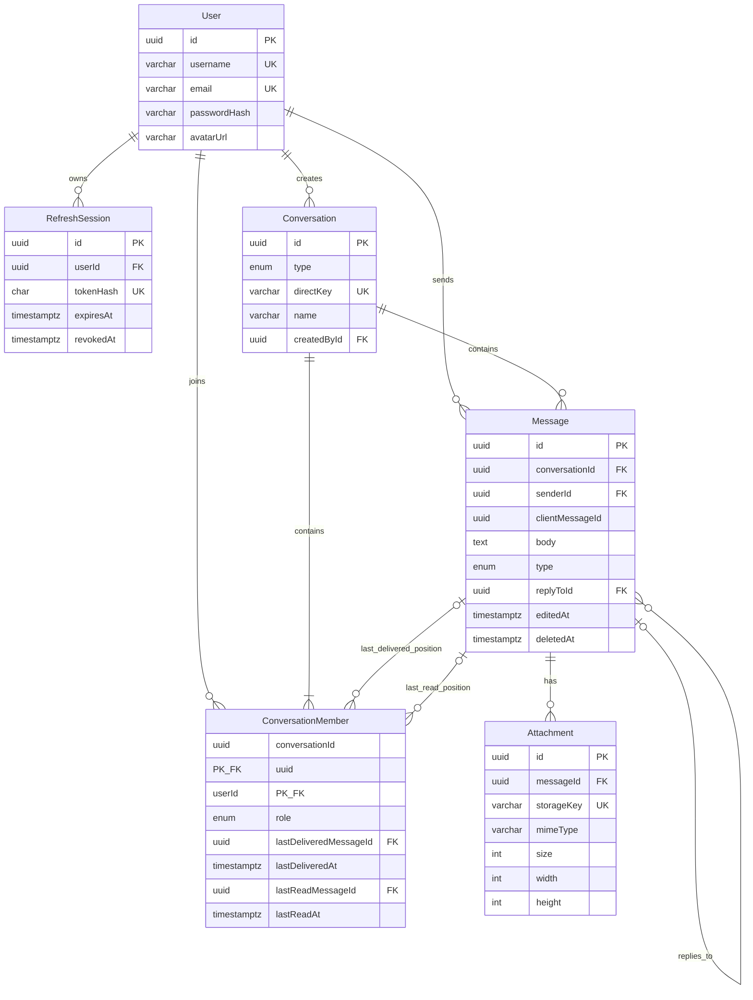

# Data model

## Important invariants

- A conversation membership is unique by `(conversationId, userId)` and carries the member role plus monotonic delivered/read positions.
- A direct conversation uses a canonical sorted participant key, preventing duplicate one-to-one conversations under concurrent retries.
- A client message is unique by `(senderId, conversationId, clientMessageId)`, so transport retries return the existing canonical row.
- Message history is ordered and indexed by `(conversationId, createdAt DESC, id DESC)`; the ID breaks timestamp ties.
- Reply targets and delivered/read positions use conversation-scoped foreign keys, preventing references to messages from another conversation.
- Attachment storage keys are globally unique. Size and optional paired dimensions also have database checks; object bytes never enter PostgreSQL.
- Message bodies remain non-empty. The application service accepts up to four attachment rows in addition to the message text.

## Delete behavior

- Message deletion is a soft delete: `deletedAt` is set, response bodies become `null`, attachments are hidden, and private download authorization fails.
- Physically deleting a conversation cascades to memberships, messages, and then attachment metadata.
- Physically deleting a message cascades to attachment metadata. Receipt pointers are intentionally not cascaded automatically; maintenance/test deletion clears them first.
- Deleting a user cascades refresh sessions and memberships, but sent messages and created conversations restrict deletion so durable authorship is not silently erased.
- Attachment objects are external. Unattached/physically deleted object cleanup requires a bucket lifecycle policy or a later cleanup worker.

The authoritative schema is [`prisma/schema.prisma`](../prisma/schema.prisma); committed migrations contain PostgreSQL-specific checks and indexes that Prisma schema syntax cannot express.
